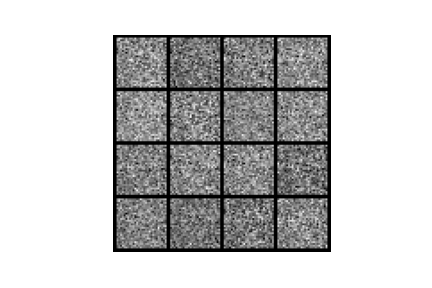

# Generative Adiversarial Networks (GANs)

<p align="center", width="100%">
    
</p>

Generative Adversarial Networks is a concept introduced by [Ian Godfellow et al.](https://arxiv.org/abs/1406.2661) in which two neural networks (NN) compete with adversarial tasks, the Discriminator and the Generator.

The Discriminator must learn a descriptor of the training data and classificate it either as false or not, and the Generator that must learn a distribution probability function in order to generate data from input noise to fool the Discriminator. If the generator achieve the task of fooling the Discriminator, then it has learned a distribution that generates new data similar to the training data descriptor.

This repository implements the proposed methodoly of the previously mentioned article, using Pytorch as training framework, and further providing a ONNX model conversion for inference purposes.

## Project Structure

The project is structured into [utilities python scripts](./utils), used as packages to build the utilies package through [setup.py](setup.py) and [jupyter notebook files](./notebooks) used for training and visualization. A [requirements file](requirements.txt) is also provided to build the utilies packages and automaticaly install its dependencies.

### Utilities

These are the following utilities packages and their function:

* [logger.py](./utils/logger.py) - Defines a Logger class to register the errors of the NNs and log/display the resulting image during training
* [networks.py](./utils/networks.py) - Contains the model backbones implemented in PyTorch
* [onnx_utils.py](./utils/onnx_utils.py) - Functions to assist ONNX model conversion from PyTorch trained models
* [result_to_gif.py](./utils/result_to_gif.py) - Concatenates the training images into a GIF
* [tensors.py](./utils/tensors.py) - Some useful tensors definition
* [transforms.py](./utils/transforms.py) - Some useful Tensor transforms for the application

### Notebooks

The Notebooks directory's goal is to store the notebooks and possible data generated from them. Currently there is only the implementation of the [Vanilla GAN](./notebooks/vanilla_GAN.ipynb) and the flow description of such. It is intended to provide different implementations and further researches regarding the thema. The following result is observed from the GAN trained in the mentioned notebook.

<p align="center", width="100%">
    
</p>

## Usage

The main purpose of this repository is to use the notebooks as source of coding and development. In order to do so, the utilities packages and dependencies must be installed. This can be achieved either by using the `pip` package manager or by using the [setup.py](setup.py) script. In order to use pip, just type the code bellow in the root directory of the project

```
pip install -e .
```

The presented command will build the local package as well as keep tracking of eventual changes without the need of reinstallation. Next the notebooks should be used without dependency problems.